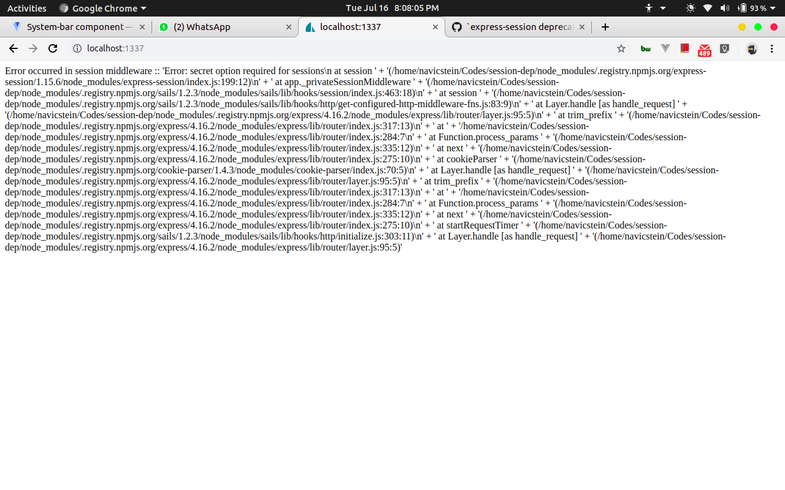
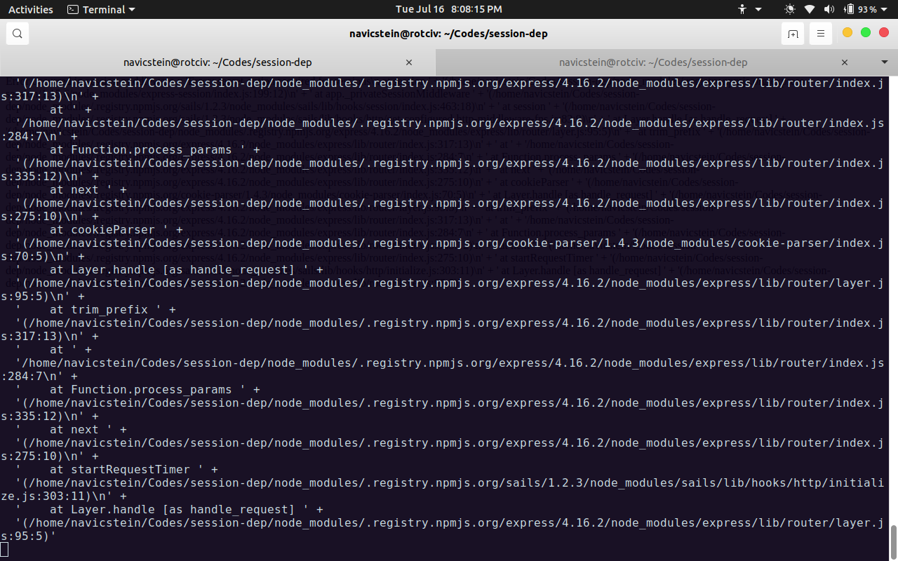
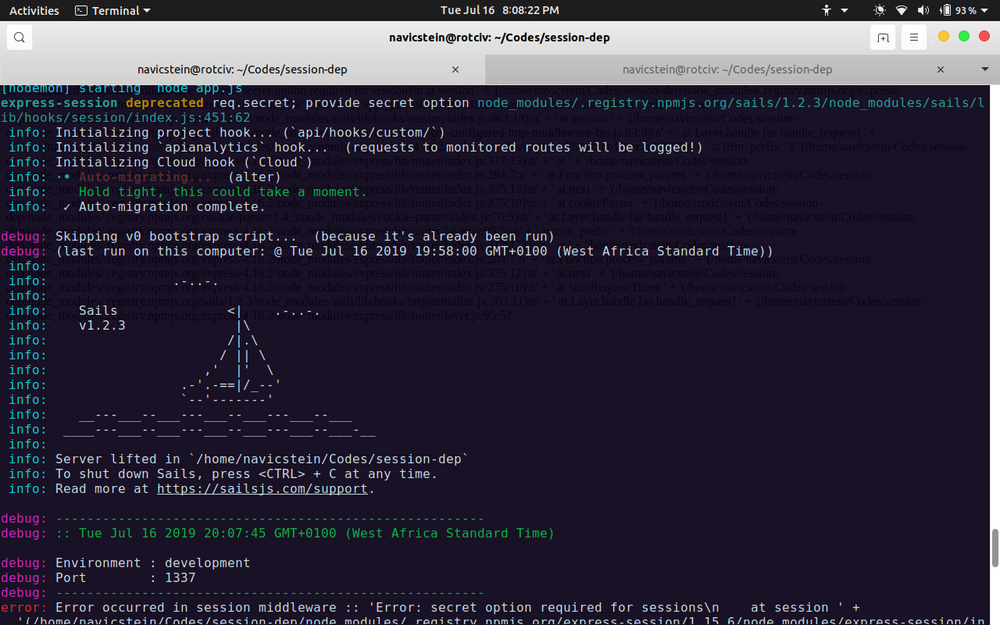
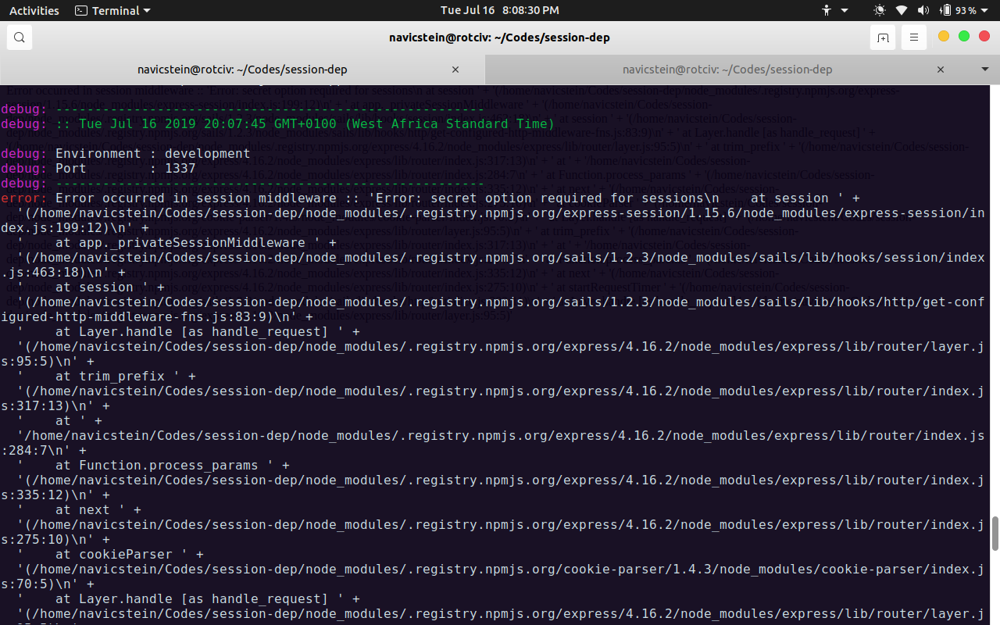
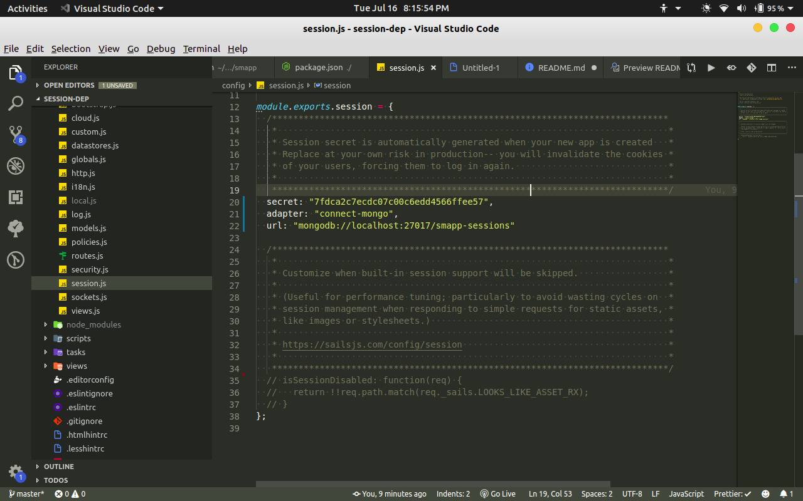

# session-dep

a [Sails v1](https://sailsjs.com) application

### This is an example repo to reproduce an error in a fresh Sails app

This is the issue url
<a href="https://github.com/balderdashy/sails/issues/6810">https://github.com/balderdashy/sails/issues/6810</a>

### Version info

This app was originally generated on Tue Jul 16 2019 19:55:05 GMT+0100 (West Africa Standard Time) using Sails v1.2.2.

### Screenshots Proof

<!-- Internally, Sails used [`sails-generate@1.16.13`](https://github.com/balderdashy/sails-generate/tree/v1.16.13/lib/core-generators/new). -->

<!--
Note:  Generators are usually run using the globally-installed `sails` CLI (command-line interface).  This CLI version is _environment-specific_ rather than app-specific, thus over time, as a project's dependencies are upgraded or the project is worked on by different developers on different computers using different versions of Node.js, the Sails dependency in its package.json file may differ from the globally-installed Sails CLI release it was originally generated with.  (Be sure to always check out the relevant [upgrading guides](https://sailsjs.com/upgrading) before upgrading the version of Sails used by your app.  If you're stuck, [get help here](https://sailsjs.com/support).)
-->
